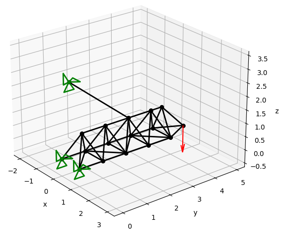
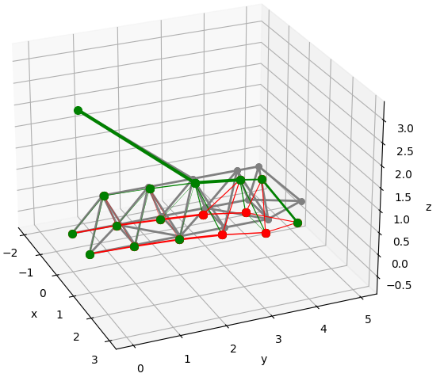

# Finite Element - 3D Truss

This code has been written for educational purposes.

## Reference
This code is mainly based on 'A.J.M. Ferreira, MATLAB Codes for Finite Element Analysis, _Solid Mechanics and its Applications_, 2014, DOI: https://doi.org/10.1007/978-1-4020-9200-8'

## Presentation
`demo.py` shows how to use `FeaTruss3D`. This demo deals with the following case, a basic crane:

### Inputs
Their are five `.txt` inputs and one parameter to write into the main code.

| Name | Description |
|------|-------------|
| nodesCoor.txt | Text file with a list of the coordinates of all the nodes. |
| elementsConnect.txt | Text file with a list of the connected nodes for each element. |
| restrictedDof.txt | Text file with the index of all restricted nodes followed by the associated restriction, _e.g._ node 2 restricted on _x_ and _z_ is written in the text file '2 1 0 1'. |
| loads.txt | Text file with the index of the nodes where loads are applied, followed by the load components, _e.g._ node 5 with 100 N in _x_ and -250 N in _y_ is written '5 100 -250 0'. |
| crossSectionArea.txt | Text file with the cross section of each element. |
| E | Young's modulus. |

### Outputs

+ List of all nodal displacements.
+ List of all nodal reactions.
+ List of all element stress.

 

+ Display of the undeformed structure with all boundary conditions.
+ Display of the deformed structure.
+ Display of the deformed structure with a colour scale representing the compression or tension in all the elements.

